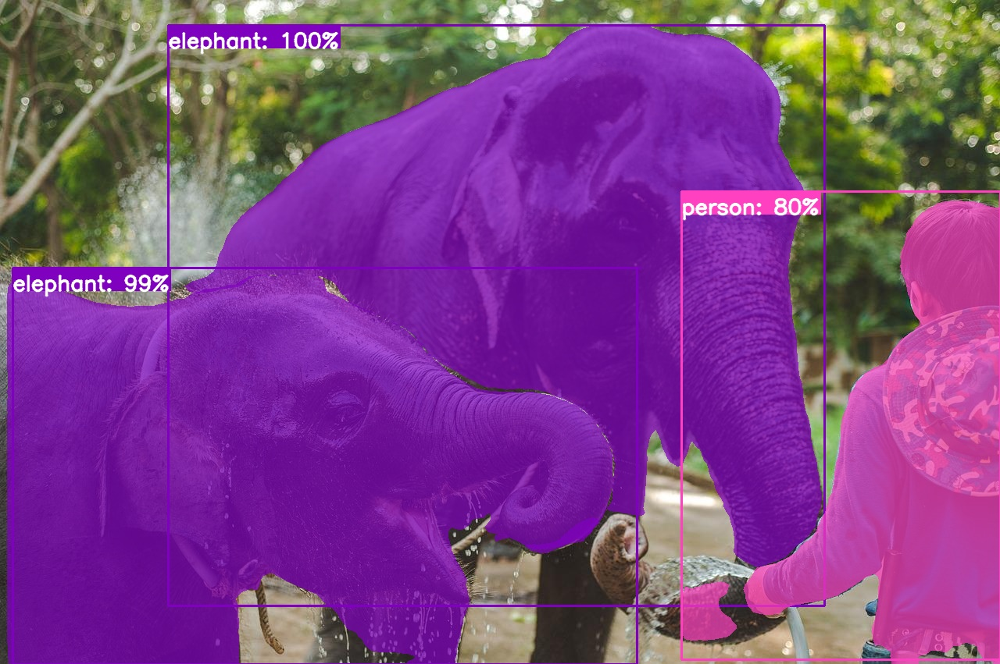

# Deploying Image Segmentation Models with DeepSparse

This page explains how to benchmark and deploy an image segmentation with DeepSparse.

There are three interfaces for interacting with DeepSparse:
- **Engine** is the lowest-level API that enables you to compile a model and run inference on raw input tensors.

- **Pipeline** is the default DeepSparse API. Similar to Hugging Face Pipelines, it wraps Engine with pre-processing
and post-processing steps, allowing you to make requests on raw data and receive post-processed predictions.

- **Server** is a REST API wrapper around Pipelines built on [FastAPI](https://fastapi.tiangolo.com/) and [Uvicorn](https://www.uvicorn.org/). It enables you to start a model serving
endpoint running DeepSparse with a single CLI.

We will walk through an example of each using YOLACT.

## Installation Requirements

This use case requires the installation of [DeepSparse Server and YOLO](https://docs.neuralmagic.com/get-started/install/deepsparse).

Confirm your machine is compatible with our [hardware requirements](https://docs.neuralmagic.com/user-guides/deepsparse-engine/hardware-support).

## Benchmarking

We can use the benchmarking utility to demonstrate the DeepSparse's performance. The numbers below were run on a 4 core `c6i.2xlarge` instance in AWS.

### ONNX Runtime Baseline

As a baseline, let's check out ONNX Runtime's performance on YOLACT. Make sure you have ORT installed (`pip install onnxruntime`).

```bash 
deepsparse.benchmark \
  zoo:cv/segmentation/yolact-darknet53/pytorch/dbolya/coco/base-none \
  -b 64 -s sync -nstreams 1 \
  -e onnxruntime

> Original Model Path: zoo:cv/segmentation/yolact-darknet53/pytorch/dbolya/coco/base-none
> Batch Size: 64
> Scenario: sync
> Throughput (items/sec): 3.5290
```

ONNX Runtime achieves 3.5 items/second with batch 64.

### DeepSparse Speedup
Now, let's run DeepSparse on an inference-optimized sparse version of YOLACT. This model has been 82.5% pruned and quantized to INT8, while retaining >99% accuracy of the dense baseline on the `coco` dataset.

```bash
deepsparse.benchmark \
  zoo:cv/segmentation/yolact-darknet53/pytorch/dbolya/coco/pruned82_quant-none \
  -b 64 -s sync -nstreams 1 \
  -e deepsparse
 
> Original Model Path: zoo:cv/segmentation/yolact-darknet53/pytorch/dbolya/coco/pruned82_quant-none
> Batch Size: 64
> Scenario: sync
> Throughput (items/sec): 23.2061
```

DeepSparse achieves 23 items/second, a 6.6x speed-up over ONNX Runtime!

## DeepSparse Engine
Engine is the lowest-level API for interacting with DeepSparse. As much as possible, we recommended using the Pipeline API but Engine is available if you want to handle pre- or post-processing yourself.

With Engine, we can compile an ONNX file and run inference on raw tensors.

Here's an example, using a 82.5% pruned-quantized YOLACT model from SparseZoo:

```python
from deepsparse import Engine
from deepsparse.utils import generate_random_inputs, model_to_path
import numpy as np

# download onnx from sparsezoo and compile with batchsize 1
sparsezoo_stub = "zoo:cv/segmentation/yolact-darknet53/pytorch/dbolya/coco/pruned82_quant-none"
batch_size = 1
compiled_model = Engine(
  model=sparsezoo_stub,   # sparsezoo stub or path to local ONNX
  batch_size=batch_size   # defaults to batch size 1
)

# input is raw numpy tensors, output is raw data
inputs = generate_random_inputs(model_to_path(sparsezoo_stub), batch_size)
output = compiled_model(inputs)

print(output[0].shape)
print(output)

# (1, 19248, 4)

# [array([[[ 0.444973  , -0.02015   , -1.3631972 , -0.9219434 ],
# ...
# 9.50585604e-02, 4.13608968e-01, 1.57236055e-01]]]], dtype=float32)]
```

## DeepSparse Pipelines
Pipeline is the default interface for interacting with DeepSparse.

Like Hugging Face Pipelines, DeepSparse Pipelines wrap pre- and post-processing around the inference performed by the Engine. This creates a clean API that allows you to pass raw text and images to DeepSparse and receive the post-processed predictions, making it easy to add DeepSparse to your application.

Let's start by downloading a sample image: 
```bash 
wget https://huggingface.co/spaces/neuralmagic/cv-yolact/resolve/main/thailand.jpeg
```
We will use the `Pipeline.create()` constructor to create an instance of an image segmentation Pipeline with a 82% pruned-quantized version of YOLACT trained on `coco`. We can then pass images to the `Pipeline` and receive the predictions. All the pre-processing (such as resizing the images) is handled by the `Pipeline`.

```python
from deepsparse.pipeline import Pipeline

model_stub = "zoo:cv/segmentation/yolact-darknet53/pytorch/dbolya/coco/pruned82_quant-none"
yolact_pipeline = Pipeline.create(
    task="yolact",
    model_path=model_stub,
)

images = ["thailand.jpeg"]
predictions = yolact_pipeline(images=images)
# predictions has attributes `boxes`, `classes`, `masks` and `scores`
predictions.classes[0]
# [20,......, 5]
```

### Use Case Specific Arguments
The Image Segmentation Pipeline contains additional arguments for configuring a `Pipeline`.

#### Classes
The `class_names` argument defines a dictionary containing the desired class mappings. 

```python
from deepsparse.pipeline import Pipeline

model_stub = "zoo:cv/segmentation/yolact-darknet53/pytorch/dbolya/coco/pruned82_quant-none"
images = ["thailand.jpg"]

yolact_pipeline = Pipeline.create(
    task="yolact",
    model_path=model_stub,
    class_names="coco",
)

predictions = yolact_pipeline(images=images, confidence_threshold=0.2, nms_threshold=0.5)
# predictions has attributes `boxes`, `classes`, `masks` and `scores`
predictions.classes[0]
['elephant','elephant','person',...'zebra','stop sign','bus']
```

### Annotate CLI
You can also use the annotate command to have the engine save an annotated photo on disk.
```bash
deepsparse.instance_segmentation.annotate --source thailand.jpeg #Try --source 0 to annotate your live webcam feed
```
Running the above command will create an `annotation-results` folder and save the annotated image inside.

If a `--model_filepath` arg isn't provided, then `zoo:cv/segmentation/yolact-darknet53/pytorch/dbolya/coco/pruned82_quant-none` will be used by default.



### Cross Use Case Functionality
Check out the [Pipeline User Guide](../../user-guide/deepsparse-pipelines.md) for more details on configuring a Pipeline.

## DeepSparse Server
Built on the popular FastAPI and Uvicorn stack, DeepSparse Server enables you to set up a REST endpoint for serving inferences over HTTP. Since DeepSparse Server wraps the Pipeline API, it inherits all the utilities provided by Pipelines.

The CLI command below launches an image segmentation pipeline with a 82% pruned-quantized YOLACT model:

```bash
deepsparse.server \
    --task yolact \
    --model_path "zoo:cv/segmentation/yolact-darknet53/pytorch/dbolya/coco/pruned82_quant-none" --port 5543
```
Run inference: 
```python
import requests
import json

url = 'http://0.0.0.0:5543/predict/from_files'
path = ['thailand.jpeg'] # list of images for inference
files = [('request', open(img, 'rb')) for img in path]
resp = requests.post(url=url, files=files)
annotations = json.loads(resp.text) # dictionary of annotation results
boxes, classes, masks, scores = annotations["boxes"], annotations["classes"], annotations["masks"], annotations["scores"]
```
#### Use Case Specific Arguments
To use the `class_names` argument, create a Server configuration file for passing the argument via kwargs.

This configuration file sets `class_names` to `coco`:

```yaml
# yolact-config.yaml
endpoints:
  - task: yolact
    model: zoo:cv/segmentation/yolact-darknet53/pytorch/dbolya/coco/pruned82_quant-none
    kwargs:
      class_names: coco
```
Start the server: 
```bash
deepsparse.server --config-file yolact-config.yaml
```
Run inference: 
```python
import requests
import json

url = 'http://0.0.0.0:5543/predict/from_files'
path = ['thailand.jpeg'] # list of images for inference
files = [('request', open(img, 'rb')) for img in path]
resp = requests.post(url=url, files=files)
annotations = json.loads(resp.text) # dictionary of annotation results
boxes, classes, masks, scores = annotations["boxes"], annotations["classes"], annotations["masks"], annotations["scores"]
```
### Cross Use Case Functionality

Check out the [Server User Guide](../../user-guide/deepsparse-server.md) for more details on configuring the Server.
