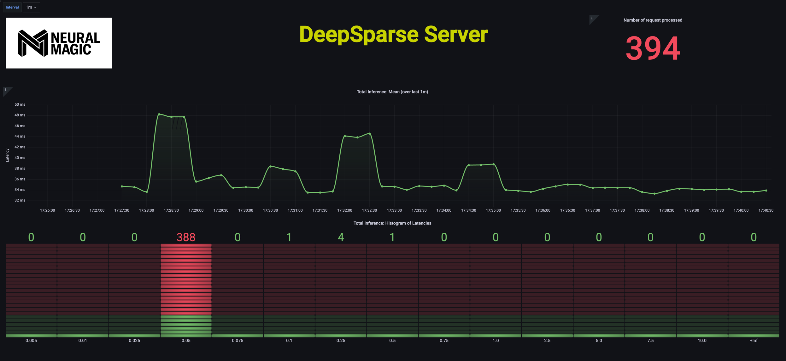

# DeepSparse Server Monitoring via Prometheus/Grafana

One of the features of the [DeepSparse Server](https://github.com/neuralmagic/deepsparse/tree/main/src/deepsparse/server) is its compatibility with the monitoring services popular among ML practitioners. 

This tutorial will show you how to monitor the DeepSparse server using the Prometheus/Grafana stack.
You will learn how to quickly configure DeepSparse Server and Prometheus, to continuously and seamlessly monitor the Server.

#### In the nutshell: 
Once configured, the Server exposes `metrics` endpoint, which in turn is scraped by Prometheus - different logs are being collected, aggregated, and stored. 
Prometheus allows external entities (like Grafana) to access these aggregated logs via the query language PromQL. 
The role of Grafana is to allow users to visualize these metrics by creating dashboards.

## Prerequisites
### Structure of the Repository
The repository has the following structure:

```bash
.
├── client 
│   ├── client.py # simple client application
│   └── piglet.jpg 
├── server_config.yaml # specifies the configuration of the DeepSparse server
├── docker # specifies the configuration of the containerized Prometheus/Grafana stack
│   ├── docker-compose.yaml
│   └── prometheus.yaml
└── grafana # specifies the design of the Grafana dashboard
    └── dashboard.json
```
### Installing DeepSparse Server

Install the server using the following command:

```bash
pip install deepsparse[server]
```

## 1. Spin up the DeepSparse Server

`server_config.yaml` specifies the config of the DeepSparse Server. It looks like the following:

```yaml
# server_config.yaml

num_cores: 2
num_workers: 2

loggers:                        # << relevant to logging
  prometheus:           
    port: 6100
    
system_logging: on              # << relevant to logging

endpoints:
  - task: image_classification
    batch_size: 1
    model: zoo:cv/classification/resnet_v1-50/pytorch/sparseml/imagenet/pruned95_quant-none
    name: image_classification_pipeline
    data_logging:               # << relevant to logging
        pipeline_inputs:
        ...
```

`server_config.yaml` instructs the server to create an image classification pipeline. There are three items relevant to logging. We can see that Prometheus logs are declared to be exposed on port `6100`, system logging is turned on, and several data logs have been specified.

Thus, once launched, the Server also exposes two endpoints:
- port `6100`: exposes the `metrics` endpoint through [Prometheus python client](https://github.com/prometheus/client_python). This is the endpoint that the Prometheus service is to scrape for logs.
- port `5543`: exposes the endpoint for inference.

To spin up the Server execute:
```
deepsparse.server --config server_config.yaml
```

To validate that metrics are being properly exposed, visit `localhost:6100`. It should contain logs in the specific format meant to be used by the PromQL query language.

## 2. Setup Prometheus/Grafana Stack

For simplicity, we have provided a `docker-compose` file that automatically spins up the containerized Prometheus/Grafana stack.

Note: in the `docker-compose` file we are passing an appropriate [config file](https://prometheus.io/docs/prometheus/latest/configuration/configuration/) `prometheus.yaml` to the Prometheus container.
The configuration file defines dynamic parameters of the Prometheus service. In our example, those are scraping jobs - e.g. pointing to the instances that are to be scraped.
Inside the file `prometheus.yaml`, the `scrape_config` has the information about the `metrics` endpoint exposed by the server on port `6100`.

To start up a Prometheus stack to monitor the DeepSparse Server, run:

```bash
cd docker
docker-compose up
```

## 3. Launch the Python Client and Run Inference

Run:

```bash
python client/client.py client/piglet.jpg 5543
```

to instantiate a simple client, that periodically sends requests to the Server. 
The client simulates the behavior of some application, that sends the raw inputs to the inference server and receives the outputs.
The first argument is the path to the sample image, while the second argument is the port number that matches the inference endpoint of the Server.

Note: It is very easy to create your own custom client, that communicates with the DeepSparse Server. 
In the separate [README](https://github.com/neuralmagic/deepsparse/tree/main/src/deepsparse/server),
we instruct the users how they can communicate with the Server (that serves one or multiple models) either through:
- a convinient Python API
- `curl` command from terminal
- [Swagger UI](https://swagger.io/tools/swagger-ui/)

## 4. Inspecting the Prometheus/Grafana Stack

You may visit `localhost:9090` to inspect whether Prometheus recognizes the `metrics` endpoint (`Status` -> `Targets`)


Visit `localhost:3000` to launch Grafana. Log in with the default username (`admin`) and password (`admin`). 
Setup the Prometheus data source (`Add your first data source` -> `Prometheus`). 

Now you should be ready to create/import your dashboard. If you decide to import the dashboard, either upload `grafana/dashboard.json` or 
paste its contents using Grafana's `import` functionality.




