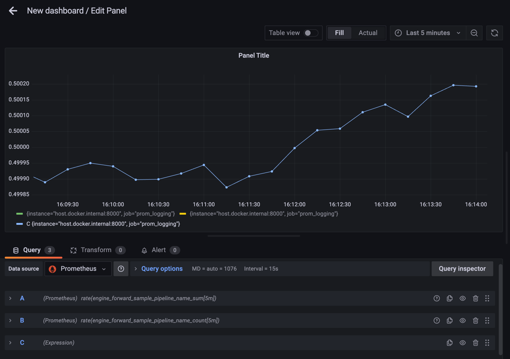

# Grafana <-> Prometheus logger integration

This is a brief overview of my learnings on how to integrate Grafana with Prometheus to build monitoring dashboards.

To spin up the MVP of the functionality run:

```bash
cd /src/deepsparse/dashboards
python example.py
````

## Setup
A couple of important remarks:
- The whole setup is running on a remote machine (`{username}@{remote_address}`), with which I interact over a network.
- The example script `example.py` mocks how `PrometheusLogger` would integrate dashboards.
- Architecture in the nutshell:
  - DeepSparse pipeline feeds the metrics to the logger
  - The logger exposes the collected metrics to the Prometheus python client endpoint (port `8000`)
  - The logger triggers the setup of the Prometheus container (port `9090`) and Grafana container (port `3030`)
  - Prometheus scrapes metrics from the client's server 
  - Grafana talks to Prometheus and injects its metrics into elegant dashboards.

### PrometheusLogger 
The logger has a new constructor argument `grafana_monitoring: bool`. It specifies whether the user wishes to use Grafana to display
the logger's metrics. If yes, during the `PrometheusLogger` construction the logger calls a method that runs `docker-compose` as a subprocess. 
This starts two docker containers:
- Prometheus container (requires mounting a local `.yaml` config file)
- Grafana container

Docker-compose is currently set up so, that it reloads every time and returns the verbose set of logs. This can be eventually suppressed, but it's 
good for debugging.

**Note**: when setting up the docker containers user may face the following error: 

`ERROR: Couldn't connect to Docker daemon at http+docker://{...} - is it running?`

If experiencing the problem, run `sudo chown $USER /var/run/docker.sock`.

### Exploring Prometheus
#### Check connection to the python client
By default, the Prometheus dashboard runs on `localhost:9090`. If you are running DeepSparse remotely, you need to enable
SSH port forwarding (locally):
```bash
ssh -N -f -L localhost:9090:localhost:9090 {username}@{remote_address}
```
Inside Prometheus, go to `Status` -> `Targets`. Inside you should see a green (active) endpoint, used by the python client to expose monitoring data.
This is the location from which Prometheus scrapes the information.


Note the endpoint address that starts with `http://host.docker.internal:{...}`. The host (a machine that runs DeepSparse and holds docker containers) has a changing IP address 
(or none if you have no network access). It is Docker's recommendation is to connect to the special DNS name `host.docker.internal`, 
which resolves to the internal IP address used by the host.

#### Making sense of the logged data
Once we are sure that Prometheus can scrape the data exposed by the client, go to the `Graph` tab and query the sample expression:
```bash
rate(total_inference_sample_pipeline_name_sum[5m])/rate(total_inference_sample_pipeline_name_count[5m])
```


This gives the average (sum over counts) value of `total_inference` duration for pipeline `sample_pipeline_name`.
The average ranges from `1.499` to `1.5`, which makes sense, because:
- `time_average` sums the results from three variables that have expected value `0.5` (`random.random()` generates a float in range `(0,1)`). See:
`example.py` script.
- the period over which we take the average is large enough to give us a good approximation.

More detailed operations on the scraped data are out of the scope of this write-up.

#### Exploring Grafana
Prometheus has very limited visualization capabilities. This is why we'd like to use Grafana. It queries metrics from
Prometheus server and allows the user to build powerful dashboards.

Analogously to Prometheus, Grafana service also runs on a pre-set port `3000`. Funny enough, after enabling port tunneling, I found that
to connect to Grafana, I need to visit `{remote_address}:3000` and not `localhost:3000`. Did not have a chance to investigate this.

On the first Grafana visit, you will be asked to set up credentials. By default, both name and password are `admin`. Enter the credentials and then
skip setting the new password.

#### Add the Prometheus data source
Go to `Add your first data source` -> `Prometheus`.


In the `HTTP/URL` field change the default address to `http://{remote_address}:9090` and hit `Save & test` (bottom of the page). You should see
`Data source is working` pop-up. Return to the home page of the web UI.

#### Create a basic Grafana dashboard 
Go to `Create your first dashboard` -> `Add a new panel`. From here, you can start building the dashboard.


You can now play with designing the dashboard. I have decided to recreate the diagram that I plotted in Prometheus:



