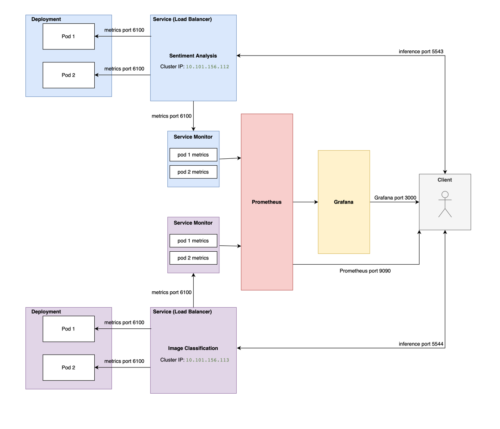

# Tutorial: DeepSparse Server Monitoring via Prometheus/Grafana

One of the features of the [DeepSparse Server](https://github.com/neuralmagic/deepsparse/tree/main/src/deepsparse/server) is its compatibility with the monitoring services popular among ML practitioners. 

This tutorial will show you how to monitor the DeepSparse server using the Prometheus/Grafana stack.
You will learn how to quickly configure DeepSparse Server and Prometheus, to continuously and seamlessly monitor the Server.

In the nutshell: once configured, the Server exposes `metrics` endpoint, which in turn is scrapped by Prometheus - different logs are being collected, aggregated, and stored. 
Prometheus allows external entities (like Grafana) to access these aggregated logs via the query language PromQL. 
The role of Grafana is to allow users to visualize these metrics by creating dashboards.

## Prerequisites
### Structure of the Repository
The repository has the following structure:

```bash
.
├── client 
│   ├── client.py # simple client application
│   └── piglet.jpg 
├── deepsparse_server_config.yaml # specifies the configuration of the DeepSparse server
├── demo.sh # script that runs the contents of this tutorial
├── docker # specifies the configuration of the containerized Prometheus/Grafana stack
│   ├── docker-compose.yaml
│   └── prometheus.yaml
└── grafana # specifies the design of the Grafana dashboard
    └── dashboard.json
```
### Installing DeepSparse Server
We recommend you to install deepsparse server inside the virtual environment:

```bash
pip install virtualenv
virtualenv deepsparse_venv

source {$virtual_env_path}/bin/activate
pip install deepsparse[server]
```

### Running the Instructions of this README

All the steps described in this tutorial are summarized in the `demo.sh` script. 
To run the script:
1. Edit the variable `$virtual_env_path` in `demo.sh`to match the location of the virtual environment on your machine
2. Execute `./demo.sh` (you may need to change the script's permissions by running `chmod +x demo.sh`)

## Spin up the DeepSparse Server

The file `deepsparse_server_config.yaml` specifies the configuration of the DeepSparse Server. Once the Server is launched, 
it creates a sample `image_classification` pipeline that runs the sparsified model from SparseZoo. The Server also exposes two endpoints:

- port `6100`: exposes the `metrics` endpoint through [Prometheus python client](https://github.com/prometheus/client_python). This is the endpoint that the Prometheus service is to scrape for logs.
- port `5543`: exposes the endpoint for inference.

To spin up the Server execute:
```
deepsparse.server config deepsparse_server_config.yaml
```

To validate, that metrics are being properly exposed, visit `localhost:6100`. It should contain logs in the specific format meant to be used by the PromQL query language.
## Setup Prometheus/Grafana Stack

To start up a Prometheus stack to monitor the DeepSparse Server, run:

```bash
cd docker
docker-compose up
```

Note that inside the file `docker/prometheus.yaml`, the `scrape_config` has the information about the `metrics` endpoint exposed by the server on port `6100`.

## Launch the Python Client and Run Inference Continuously

Run:

```bash
python client/client.py client/piglet.jpg 5543
```

to instantiate a simple client, that periodically sends requests to the Server. 

Note: the first argument is the path to the sample image, while the second argument is the port number that matches the inference endpoint of the Server.

## Inspecting the Prometheus/Grafana Stack

You may visit `localhost:9090` to inspect whether Prometheus recognizes the `metrics` endpoint (`Status` -> `Targets`)



Visit `localhost:3000` to launch Grafana. Log in with the default username (`admin`) and password (`admin`). 
Setup the Prometheus data source (`Add your first data source` -> `Prometheus`). 

Now you should be ready to create/import your dashboard. If you decide to import the dashboard, either upload `grafana/dashboard.json` or 
paste its contents using Grafana's `import` functionality.


